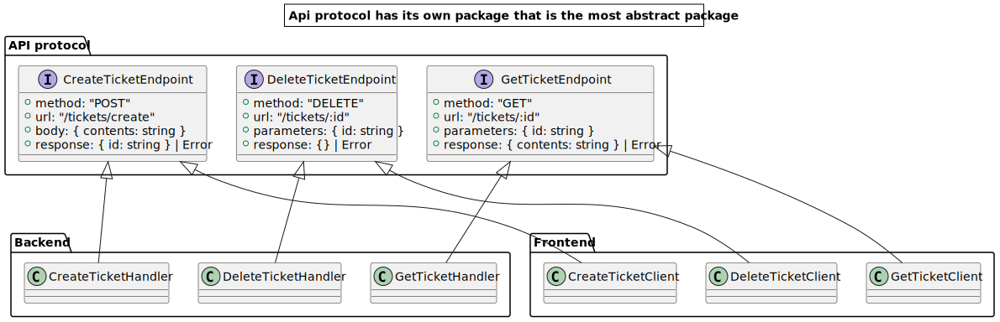
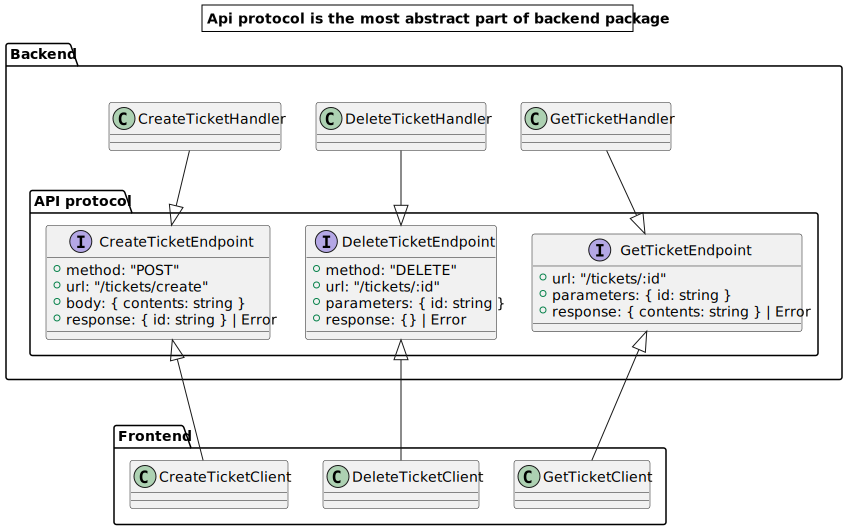

# ts-api-type-sharing
Share API types between frontend and backend compile-only

The challenge solved here is how to specify the contract (the protocol) between backend in frontend in simple applications.

Typescript gives us the ability to specify the contract using types and then sharing these types by both frontend and backend.

So the simplest option would be to have three packages:

This is a good solution to put the most abstract part of code in the separate package (e.g. the one that holds the contract between multiple modules)

But here the case with the frontend is that frontend is actually the lowest, least abstract and most concrete module. No other module is going to be dependent on the frontend. So we actually could just make the frontend be dependent on backend. 

Here, the API protocol is still the most abstract module of the project but conveniently lies within the backend. So now the frontend is dependent on the backend. But if you thinkout that, actually frontend is almost always dependent on the backend. So now we have just stated that relation explicitly.

Now, creating a strong bond and sharing the actual code would create environment and library dependencies and could cause issues with certain functions that are different between NodeJS and browser JS. Instead we can use two typescript features that would allow us to create dependency only during the compile time so that the compiler verifies if we have called the endpoints correctly: `import type` and `Project References`.

Let's see how we can apply them.
